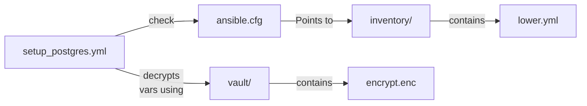

# Postgres

## setup_postgres.yml

### Directory

```text
.
└─── playbooks
│	  └─ db
│	  	 └─ setup_postgres.yml
├── inventory
│   └─ lower.yml
├── vault
│		└─ encrypt.enc
└─── ansible.cfg  	 
	  	 
```




#### Example

```
ansible-playbook playbooks/db/setup_postgres.yml -e @vault/db_lower.enc --ask-vault-pass
```

follow up by running `create_pg_dbs.yml` to create the databases and users.
